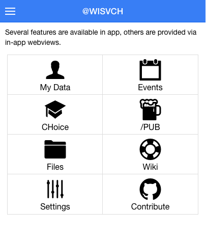

# CH App
App for W.I.S.V. 'Christiaan Huygens'. Using Meteor for quick development and live code pushes. Leveraging our new OpenID Connect Authorization Endpoint and API's to provide awesome functionality for members.

# (Potential) Features:

- [ ] OpenID Connect login
- [ ] Personal Details editing
- [ ] Events
- [ ] Events RSVP (lunch lectures but also payed events, after payment)
- [ ] Study planner (integrated with Osiris and TU API for planned future courses)
- Quick access to:
	- [ ] CHoice (pre-filtered)
	- [ ] Wiki
	- [ ] WebDAV (ideally using WebDAV-intent/schema-url for editing)
	- [x] Github page
	- [ ] Pub calendar
	
# Screenshots

